# Prova Finale di Ingegneria del Software - a.a. 2022-2023

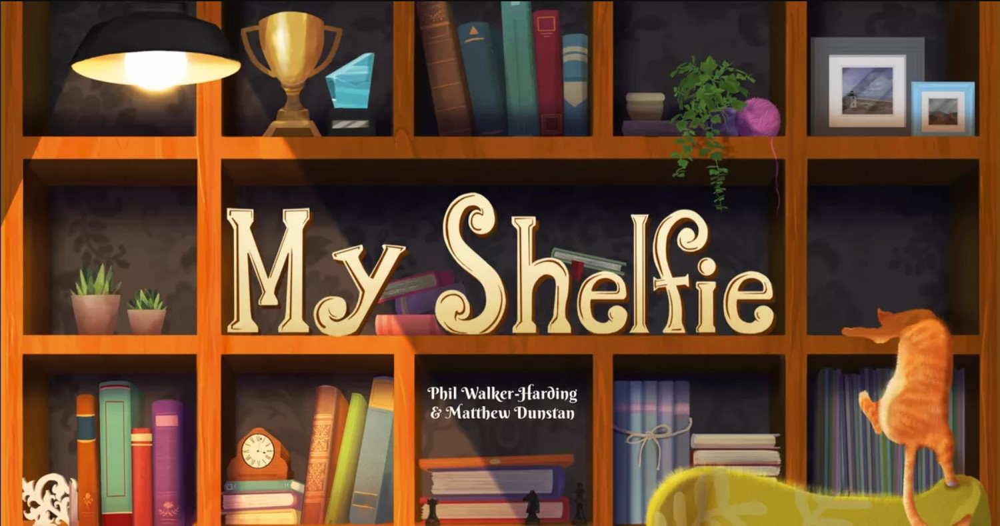

Scopo del progetto è quello di implementare il gioco da tavolo MyShelfie in Java.
Il progetto è composto da 2 eseguibili JAR, rispettivamente per Client e Server.

## Indice Analitico
1. [Documentazione](#documentazione)
   - [UML Iniziale](#uml-iniziale)
   - [UML Finale](#uml-finale)
   - [Sequence Diagrams](#sequence-diagrams)
   - [JavaDoc](#javadoc)
2. [Librerie](#librerie)
3. [Funzionalità Sviluppate](#funzionalità-sviluppate)
   - [Funzionalità Aggiuntive](#funzionalità-aggiuntive)
4. [Esecuzione dei JAR](#esecuzione-dei-jar)
   - [Client](#client)
      - [CLI](#cli)
      - [GUI](#gui)
   - [Server](#server)
      - [Dopo l'avvio del server](#dopo-lavvio-del-server)
5. [Schermate di gioco](#schermate-di-gioco)
   - [Login](#login)
   - [Gioco](#gioco)
      - [Chat](#chat)
6. [Componenti del gruppo](#componenti-del-gruppo)


## Documentazione
Di seguito è riportata la documentazione richiesta dalle specifiche di progetto, ovvero UML, Sequence diagrams e JavaDoc.

- [UML Iniziale](https://github.com/FrancescoLomastro/ing-sw-2023-Aniballi-Ferrini-Figini-LoMastro/tree/main/deliverables/final/uml)
- [UML Finale](https://github.com/FrancescoLomastro/ing-sw-2023-Aniballi-Ferrini-Figini-LoMastro/tree/main/deliverables/final/uml/Final%20UML)
- [Sequence Diagrams](https://github.com/FrancescoLomastro/ing-sw-2023-Aniballi-Ferrini-Figini-LoMastro/tree/main/deliverables/final/uml/Network%20Sequence%20Diagram)
- [JavaDoc](https://github.com/FrancescoLomastro/ing-sw-2023-Aniballi-Ferrini-Figini-LoMastro/tree/main/deliverables/final/javaDoc)

## Librerie
| Librerie   |Descrizione|
|------------|-----------|
| __Maven__  |strumento di gestione per software basati su Java e build automation|
| __Junit__  |framework dedicato a Java per unit testing|
| __Gson__   |libreria per il supporto al parsing di file in formato json|
| __JavaFx__ |libreria grafica di Java|

## Funzionalità Sviluppate
- Regole Complete
- Socket
- RMI
- CLI
- GUI

### Funzionalità Aggiuntive
- Partite Multiple
- Chat
- Persistenza
- Bonus: Rilevazione disconnessioni (Ping)

## Esecuzione dei JAR
### Client
Il client è eseguibile utilizzando l'interfaccia CLI oppure l'interfaccia GUI:

#### CLI
Per godere di una esperienza migliore si consiglia di lanciare questa interfaccia da un terminale in grado di rendereizzare i colori come Window PowerShell.  
Per lanciare il client in modalità CLI bisogna entrare nella cartella dove sono memorizzati i file JAR e digitare il seguente comando:
```
java -jar client.jar CLI
```
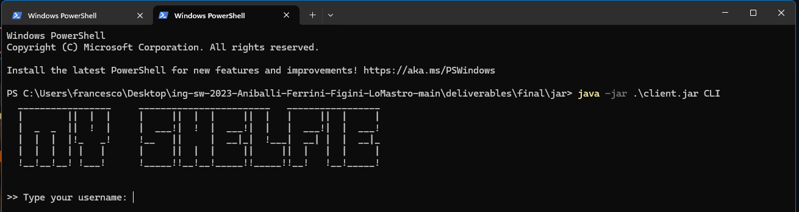
<br><br><br><br><br>
#### GUI
Per lanciare il client in modalità GUI bisogna entrare nella cartella dove sono memorizzati i file JAR e digitare il seguente comando:
```
java -jar client.jar
```
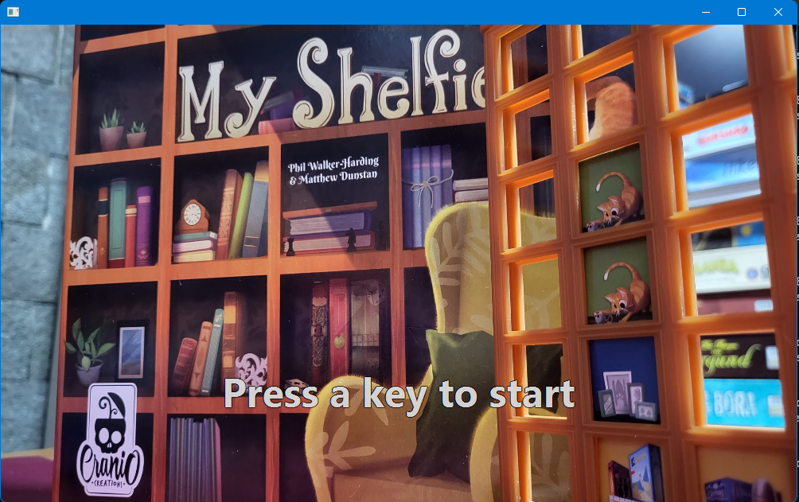
<br><br><br><br><br>
### Server
Per eseguire il programma server bisogna entrare nella cartella dove sono memorizzati i file JAR e digitare il seguente comando:
```
java -jar server.jar
```
#### Dopo l'avvio del server
- Il server è progettato per mantenere la persistenza delle partite che gestisce, a tal scopo crea dei file dove memorizzare le partite.  
  Durante lo svolgimento delle partite verrà creata una cartella `gameFile` dentro la quale vengono memorizzate le partite interrotte.
- Appena il server verrà avviato verrà mostrato un menu a doppia scelta: selezionare 0 per cancellare i file di gioco passati, 1 se invece si desidera tenerli ed utilizzare la persistenza delle partite.
  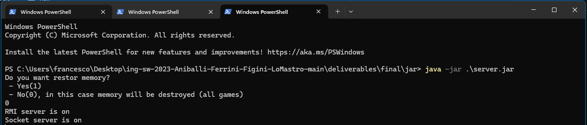
<br><br><br><br><br>

## Schermate di gioco
### Login
In questa schermata viene richiesto Username, Modalità di connessione, IP e porta.
<p align="center">
  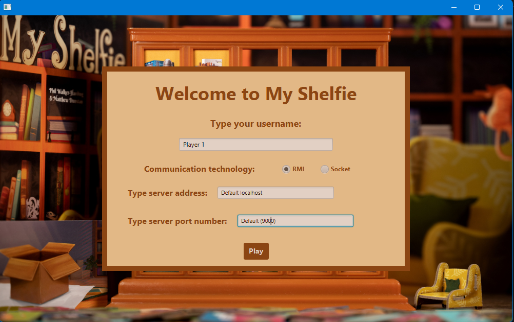
  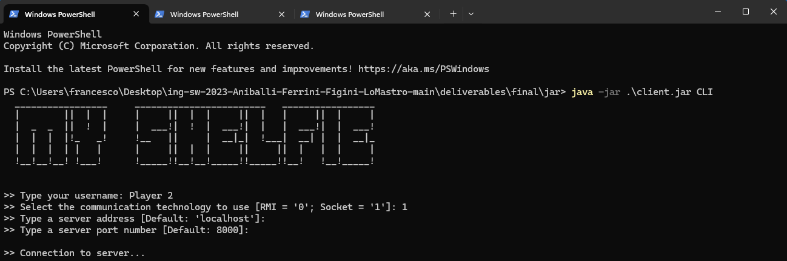
</p>

Il primo giocatore ad entrare nella lobby deve scegliere il numero di giocatori da includere nella lobby
<p align="center">
   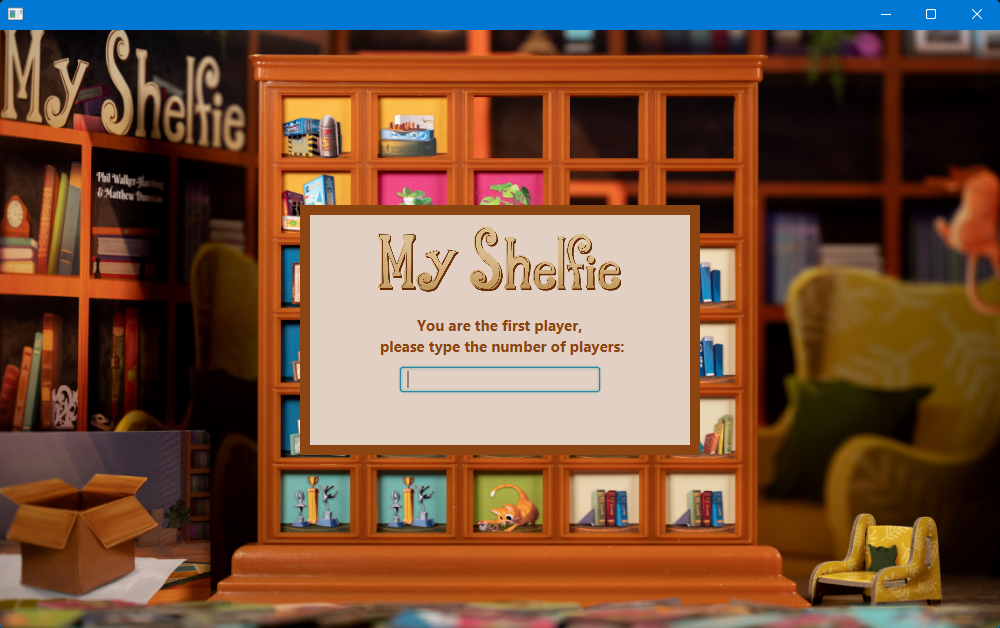
</p>
Dopo l'inizializzazione si aspetta in lobby l'inizio della partita
<p align="center">
   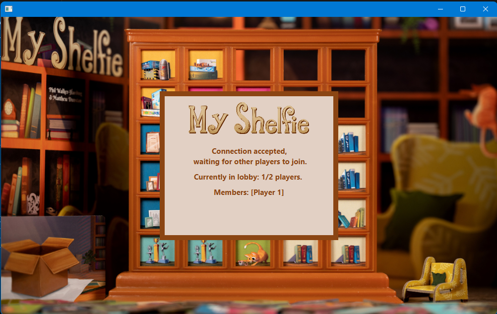
</p>

### Gioco
<p align="center">
   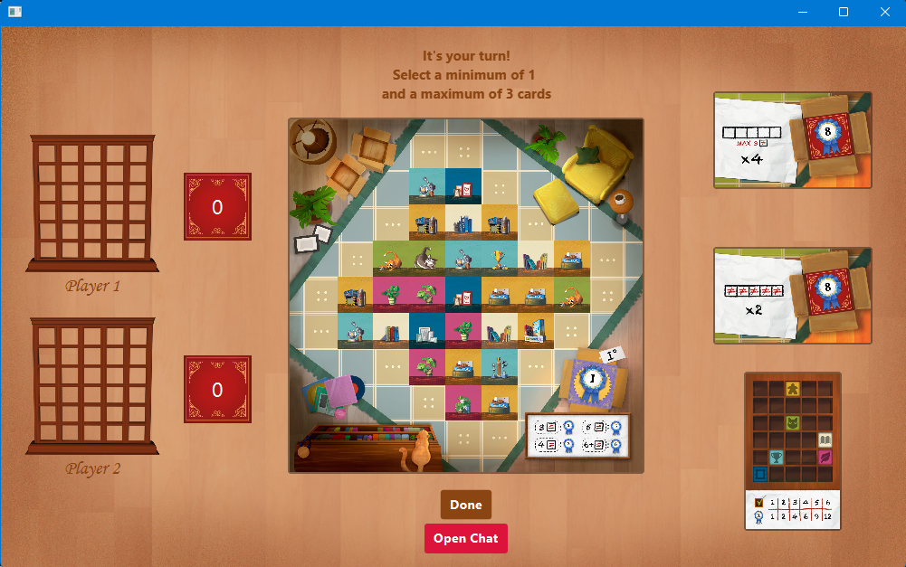
   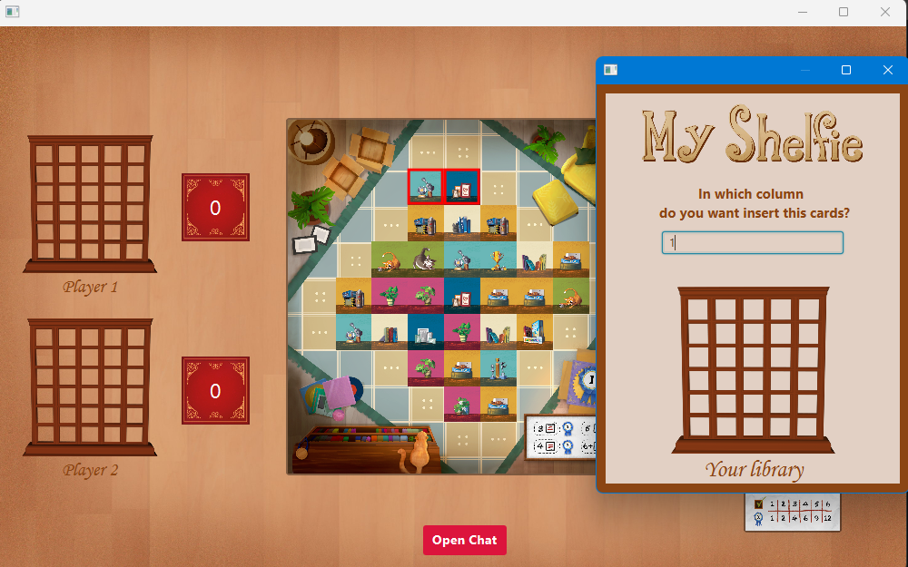
   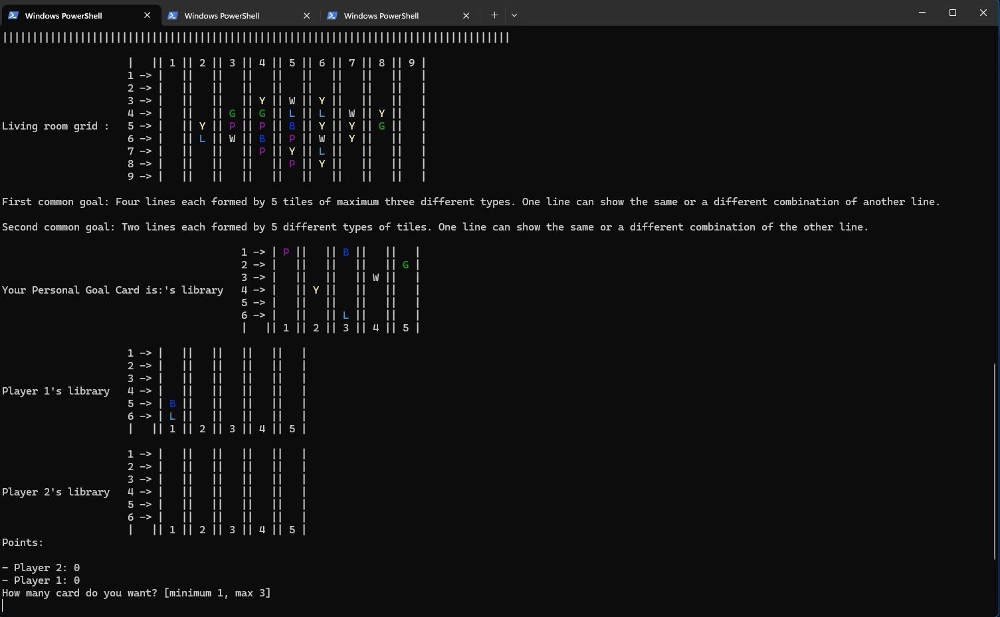
</p>

#### Chat
<p align="center">
   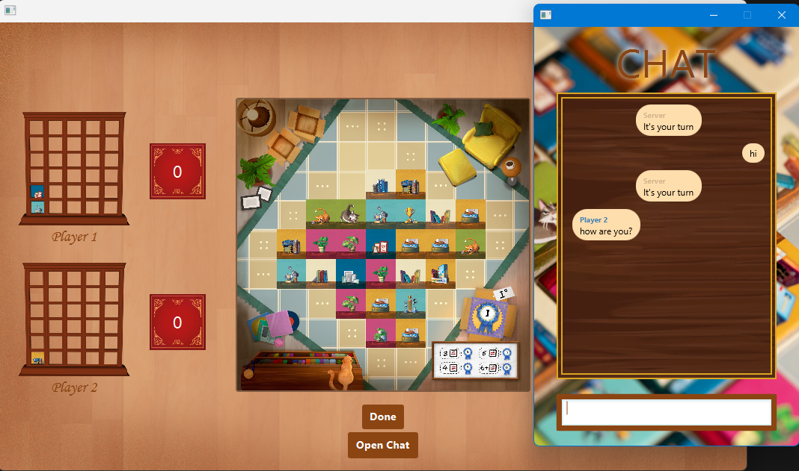
</p>
La CLI ha una limitazione:<br>
Per evitare di interrompere la mossa del giocatore CLI, i messaggi ricevuti mentre è il turno del giovatore CLI vengono sospesi. Quando la mossa termina tutti i messaggi sospesi vengono mostrati.
Inoltre, sempre per limitazione della CLI, un giocatore CLI può usare la chat solo quando è il turno degli avversari
<p align="center">
   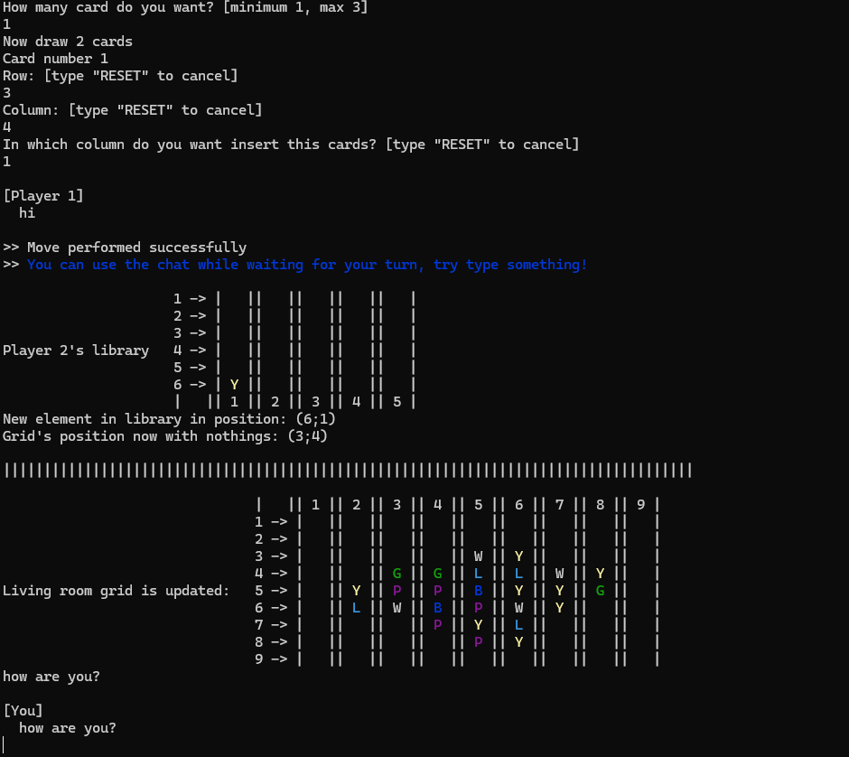
</p>

## Componenti del gruppo
- [__Alberto Aniballi__](https://github.com/AlbertoAtCode)
- [__Andrea Ferrini__](https://github.com/AndreaFerrini3)
- [__Riccardo Figini__](https://github.com/RiccardoFigini)
- [__Francesco Lo Mastro__](https://github.com/FrancescoLomastro)